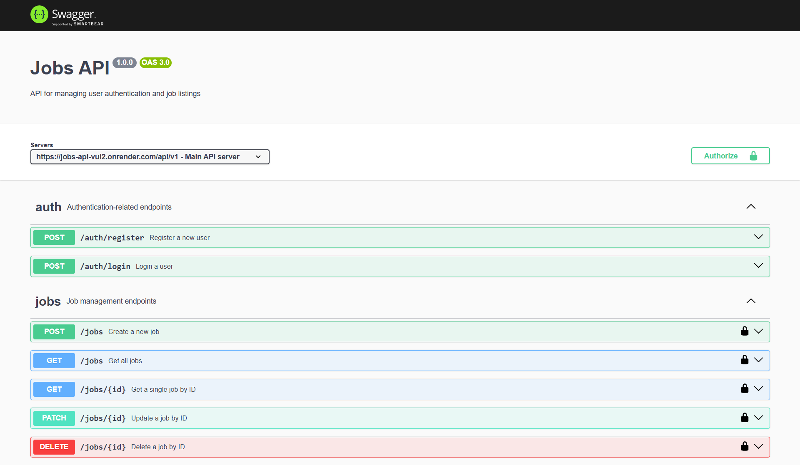

# Jobs API

A simple API for user authentication and managing job listings, built with **Node.js**, **Express**, and **MongoDB**, secured with **JWT**.

## Setup

Get started by installing dependencies and running the server:

```bash
npm install && npm start
```

## Database Connection

1. Import your `connect.js` module.
2. Call the connection function inside your app’s `start()` method.
3. Create a `.env` file in your project root.
4. Add your MongoDB URI like this:

```ini
MONGO_URI=your-mongodb-connection-string
```

## Routes Overview

- **`auth.js`**: Handles user registration and login.
- **`jobs.js`**: Handles CRUD operations for jobs (create, read, update, delete).

## User Model Details

The user model validates the email field using the following regex:

```regex
/^(([^<>()[\]\\.,;:\s@"]+(\.[^<>()[\]\\.,;:\s@"]+)*)|(".+"))@((\[[0-9]{1,3}\.[0-9]{1,3}\.[0-9]{1,3}\.[0-9]{1,3}\])|(([a-zA-Z\-0-9]+\.)+[a-zA-Z]{2,}))$/
```

## User Registration Flow

1. Validates required fields (`name`, `email`, `password`).
2. Hashes the password using `bcryptjs` before saving.
3. Creates the user in the database.
4. Generates a JWT token and returns it in the response.

## User Login Flow

1. Checks if `email` and `password` are provided.
2. Throws errors if fields are missing or incorrect.
3. Finds the user by email.
4. Compares the submitted password with the stored hashed password.
5. If valid, generates and returns a JWT token.

## Error Handling

- **Mongoose Validation Errors**: Handles missing or invalid fields.
- **Duplicate Email Errors**: Prevents registering the same email twice.
- **Cast Errors**: Handles invalid IDs (e.g., malformed MongoDB ObjectIds).

## Security Setup

- **Helmet**: Sets secure HTTP headers.
- **CORS**: Enables cross-origin requests.
- **XSS-Clean**: Sanitizes user input to prevent XSS attacks.
- **Rate Limiting**: Limits requests from the same IP to prevent abuse.

## API Documentation

The API is documented using Swagger UI. Below is a screenshot of the Swagger UI interface showing the available endpoints:



## Testing the API

### Using Swagger UI

1. Load your OpenAPI specification (e.g., YAML file) into Swagger Editor or your Swagger UI instance.
2. Click the green **Authorize** button and paste your JWT token (obtained from registering or logging in via Postman or your app).
3. Test endpoints directly from the UI (e.g., create job, get jobs, update job).

### Using Postman

1. Import your Postman collection (exported JSON).
2. Register a user or log in to obtain a JWT token.
3. Set the token as a **Bearer Token** in the Authorization tab for subsequent requests.
4. Test endpoints like creating or retrieving jobs with the token attached.

## Swagger UI Snippet Example

Example of defining a path parameter for a job ID:

```yaml
/jobs/{id}:
  parameters:
    - in: path
      name: id
      schema:
        type: string
      required: true
      description: The job’s unique ID
```